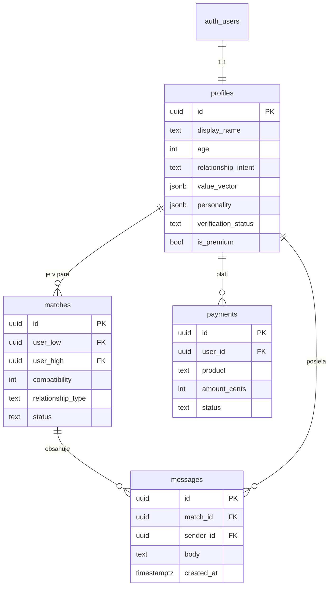

# 🗄️ Synced – Backend návrh (Supabase)

Návrhový dokument pre **Krok 6**. Popisuje databázovú schému, API, bezpečnosť
(RLS) a GDPR. Spustiteľná schéma je v [`supabase/schema.sql`](../supabase/schema.sql).

---

## 1. Prečo Supabase

Supabase = PostgreSQL + Auth + Storage + auto‑generované API + realtime, všetko
v jednom. Pre MVP ideálne: nemusíš písať vlastný server, a predsa máš plnú SQL
databázu a bezpečnosť na úrovni riadkov (RLS).

- **Auth** rieši registráciu, prihlásenie, heslá, reset.
- **Databáza** (Postgres) drží profily, matchy, správy, platby.
- **Storage** drží overovacie videá (súkromný bucket).
- **Auto API**: každá tabuľka má hneď REST endpoint; zložitejšiu logiku rieši RPC (SQL funkcie) alebo Edge Functions.
- **Realtime**: chat správy sa dajú odoberať naživo (bez refreshu).

---

## 2. Dátový model (ER diagram)

## 3. Tabuľky – prehľad

| Tabuľka | Účel | Kľúčové polia |
|---|---|---|
| **profiles** | Aplikačný „users" – profil naviazaný na Supabase Auth. Drží výstupy testu. | `value_vector`, `personality`, `relationship_intent`, `verification_status`, `is_premium` |
| **matches** | Dvojice a ich kompatibilita. Kanonické poradie `user_low < user_high` (dvojica raz). | `compatibility`, `relationship_type`, `status` |
| **messages** | Chat správy viazané na konkrétny match. | `match_id`, `sender_id`, `body` |
| **payments** | Premium, overenie, boost, report. Stav mení Stripe webhook. | `product`, `amount_cents`, `status`, `stripe_session_id` |

> Výstupy testu (hodnoty, osobnosť) ukladáme ako **jsonb** – flexibilné a presne
> zodpovedá objektu `userProfile` z frontendu, takže sa dá uložiť 1:1.

---

## 4. API endpoints

Supabase generuje REST/RPC automaticky. Logicky:

### Auth (Supabase Auth SDK)
- `supabase.auth.signUp({ email, password })` – registrácia (trigger vytvorí prázdny profil)
- `supabase.auth.signInWithPassword(...)` – prihlásenie
- `supabase.auth.signOut()`

### Profil
- **Získať vlastný**: `GET /rest/v1/profiles?id=eq.<uid>` → `supabase.from('profiles').select().single()`
- **Uložiť profil / výsledok testu**: `PATCH /profiles` → `supabase.from('profiles').update({ value_vector, personality, ... }).eq('id', uid)`

### Matchy
- **Denné matchy**: RPC alebo Edge Function `get_daily_matches()`, ktorá spočíta kompatibilitu (funkcia `calculate_compatibility` v schéme) a vráti zoradené profily.
- **Like / Pass**: `supabase.from('matches').update({ status }).eq('id', matchId)`

### Chat
- **História**: `supabase.from('messages').select().eq('match_id', id).order('created_at')`
- **Poslať**: `supabase.from('messages').insert({ match_id, sender_id, body })`
- **Realtime**: `supabase.channel('messages').on('postgres_changes', { event:'INSERT', ... })` – nové správy naživo

### Monetizácia (Edge Functions + Stripe)
- `POST /functions/v1/create-checkout` – vytvorí Stripe Checkout session, vráti URL
- `POST /functions/v1/stripe-webhook` – Stripe potvrdí platbu → cez `service_role` nastaví `payments.status = 'paid'` a napr. `profiles.is_premium = true`

### Overenie videa (Storage)
- `supabase.storage.from('verification-videos').upload(path, file)` – súkromný bucket
- profil dostane `verification_status = 'pending'`; admin/AI ho prepne na `verified`

---

## 5. Bezpečnosť – Row Level Security (RLS)

RLS je zapnutá na **všetkých** tabuľkách. Politiky (v schéme) zaručujú:

- **profiles**: vidíš **svoj** profil vždy; **cudzí** len ak s ním máš match/návrh. Upravovať vieš len svoj.
- **matches**: vidíš a meníš len páry, ktorých si účastník.
- **messages**: čítaš a píšeš len v konverzáciách, ktorých si účastník; poslať vieš len ako ty sám (`sender_id = auth.uid()`).
- **payments**: vidíš a zakladáš len svoje platby; stav mení výhradne server (Stripe webhook cez `service_role`, ktorý RLS obchádza).

Vďaka tomu **ani pri úniku API kľúča** (anon key je verejný) nikto neuvidí cudzie dáta – databáza to odmietne na svojej úrovni.

---

## 6. GDPR‑friendly zásady 🔒

- **Právo na výmaz**: `on delete cascade` – zmazanie účtu (auth.users) automaticky zmaže profil, matchy, správy aj platby. Overovacie videá treba zmazať aj zo Storage (Edge Function pri zmazaní účtu).
- **Minimalizácia**: overovacie video je citlivý údaj – po overení ho ideálne zmaž, drž len `verification_status`.
- **Účel a súhlas**: pri registrácii jasný súhlas so spracovaním; test kompatibility je dobrovoľný.
- **Prístup k dátam**: RLS = technická záruka, že sa k osobným údajom dostane len oprávnený používateľ.
- **Lokalita dát**: pri zakladaní Supabase projektu zvoľ **EU región** (napr. Frankfurt).

---

## 7. Ako sa to napojí na frontend

Dnes frontend používa `AppState` (v pamäti) a `SAMPLE_USERS` (fiktívna DB).
Pri napojení sa vymení len „zdroj dát", UI ostáva:

| Teraz (MVP frontend) | Po napojení na Supabase |
|---|---|
| `AppState.userProfile` v pamäti | riadok v `profiles` |
| `SAMPLE_USERS` (hardcoded) | `select` z `profiles` cez `get_daily_matches()` |
| `calculateCompatibility()` v JS | tá istá logika ako SQL `calculate_compatibility()` (alebo ostane v JS) |
| `AppState.chat.conversations` | tabuľka `messages` + realtime |
| mock „billing" (Krok 7) | Stripe Checkout + `payments` |

---

## 8. Ďalšie kroky implementácie

1. Založiť Supabase projekt (EU región) a spustiť `supabase/schema.sql`.
2. Vytvoriť súkromný Storage bucket `verification-videos`.
3. Do frontendu pridať `@supabase/supabase-js`, prepnúť registráciu/profil na Supabase.
4. Nahradiť `SAMPLE_USERS` reálnym dotazom + `get_daily_matches()`.
5. Chat prepnúť na tabuľku `messages` + realtime.
6. (Krok 7) Napojiť Stripe pre `payments`.

---

*Schéma je pripravená na spustenie a syntakticky overená. Bezpečnostné politiky
si po nasadení otestuj s dvoma testovacími účtami.*
