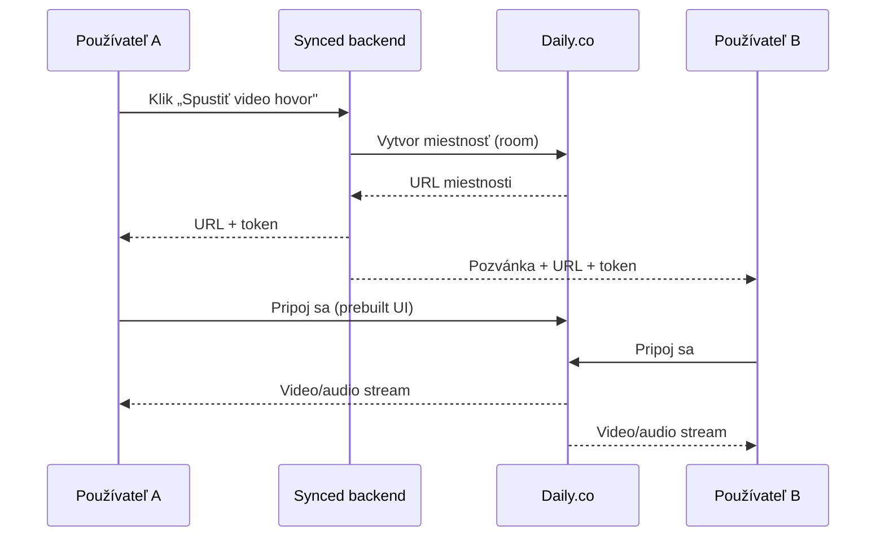

# 🎥 Synced – Architektúra videa (overenie identity + video chat)

Návrhový dokument pre **Krok 5**. Nič sa tu ešte needituje na produkčnej úrovni –
je to plán, podľa ktorého sa video neskôr napojí. V kóde k nemu patria
placeholder komponenty (sekcia *Profil → Overenie* a sekcia *Video stretnutie*).

---

## 1. Prehľad – čo staviame

Synced potrebuje dve nezávislé video funkcie:

1. **Video overenie identity** – používateľ nahrá krátke video (napr. „povedz svoje meno a dnešný dátum"), ktoré potvrdí, že je reálny človek a že sedí s profilovou fotkou. Zvyšuje dôveru a znižuje počet fejkov.
2. **Video chat 1:1** – bezpečný videohovor priamo v aplikácii medzi dvoma matchmi, bez potreby vymieňať si telefónne čísla.

Sú to dva **rôzne technické problémy** a riešia sa inak.

---

## 2. Video overenie identity

### Tok (flow)

```mermaid
flowchart TD
    A[Používateľ v profile] --> B[Nahrá krátke video 5-10s]
    B --> C[Video sa uploadne do Storage]
    C --> D[Záznam v DB: status = pending]
    D --> E{Kontrola}
    E -->|MVP: manuálne| F[Admin schváli/zamietne]
    E -->|Neskôr: AI| G[Porovnanie tváre video ↔ profilová fotka]
    F --> H[status = verified/rejected]
    G --> H
    H --> I[Odznak „Overený profil" ✅]
```

### Ukladanie videa

Odporúčam **Supabase Storage** (keďže backend plánujeme na Supabase – Krok 6):

- Súkromný bucket `verification-videos` (nie verejný!).
- Cesta: `verification-videos/{user_id}/{timestamp}.webm`.
- Prístup len cez **signed URL** s krátkou platnosťou (napr. 60 s) – nikto iný sa k videu nedostane.
- Formát: `webm` (natívne z prehliadača cez `MediaRecorder` API), max ~10 MB.

> Firebase Storage je alternatíva s rovnakým princípom, ale keďže zvyšok
> ide na Supabase, držme sa jedného ekosystému.

### Nahrávanie v prehliadači

Video sa dá nahrať priamo v prehliadači bez akejkoľvek externej služby:

- `navigator.mediaDevices.getUserMedia({ video: true, audio: true })` → prístup ku kamere
- `MediaRecorder` → nahrá krátky klip do pamäte
- upload cez Supabase JS klient (`supabase.storage.from('verification-videos').upload(...)`)

### Kontrola zhody tváre (budúcnosť, nie MVP)

V MVP stačí **manuálne schválenie** adminom (rýchle, lacné, dôveryhodné).
Neskôr sa dá zautomatizovať:

| Prístup | Ako | Poznámka |
|---|---|---|
| **Dedikovaná služba** (odporúčam) | Veriff, Onfido, Persona | Robustné, GDPR-compliant, „identity verification as a service". Najmenej práce. |
| Cloud AI | AWS Rekognition `CompareFaces` | Porovná tvár z videa a z fotky, vráti skóre zhody. Lacnejšie, ale viac práce. |
| Vlastný model | face-embedding (napr. `face-api.js`) | Najlacnejšie, ale najviac zodpovednosti a údržby. |

---

## 3. Video chat 1:1

### Ako videohovor vôbec funguje

Videohovor beží na technológii **WebRTC** (priame P2P spojenie medzi prehliadačmi).
Aby fungoval, treba tri veci:

1. **Signaling server** – „zoznámi" dvoch účastníkov (vymení si technické info o spojení). Beží na serveri.
2. **STUN/TURN server** – pomôže prebiť sa cez firewally a NAT. TURN je nutný pre ~15 % spojení a je náročný na prevádzku.
3. **Media prenos** – samotný obraz/zvuk.

Postaviť toto celé svojpomocne je veľa práce (najmä TURN). Preto sa v MVP
používa **hotová služba**, ktorá to celé rieši za teba.

### Porovnanie služieb (stav 2026)

| Služba | Pre MVP | Free tier | Poznámka |
|---|---|---|---|
| **Daily.co** ⭐ | **Odporúčam** | 10 000 minút/mesiac zadarmo | Prebuilt UI (`<iframe>`) – hovor rozbehneš za pár hodín. Potom ~$0,004 za účastnícku minútu. |
| **LiveKit** | Dobrá voľba | Štedrý free tier v cloude | Open-source – neskôr sa dá **self-hostovať** a šetriť. Viac kódu ako Daily. |
| **Twilio Video** | S opatrnosťou | – | V 2024 ohlásili koniec, potom to **zrušili** a nechali bežať pre 1:1. Technicky OK, ale tá neistota poškodila dôveru – nie prvá voľba pre nový projekt. |
| **Vlastné WebRTC** | Neskôr | Len náklady na server | Najlacnejšie pri veľkom objeme, ale musíš prevádzkovať signaling + TURN. „Own it later". |

### Odporúčaný tok pre MVP (Daily.co)



MVP postup: hovor sa spúšťa **len medzi existujúcimi matchmi**, miestnosť je
súkromná (token s krátkou platnosťou), po skončení hovoru sa zahodí.

---

## 4. Odporúčaný stack pre MVP

| Funkcia | MVP riešenie | Neskôr |
|---|---|---|
| Nahrávanie overovacieho videa | Prehliadač (`MediaRecorder`) | – |
| Úložisko videa | Supabase Storage (súkromný bucket) | CDN pri raste |
| Kontrola identity | Manuálne (admin) | Veriff / AWS Rekognition |
| Video chat 1:1 | **Daily.co** (prebuilt) | LiveKit self-host / vlastné WebRTC |

**Prečo takto:** v MVP chceš čo najrýchlejšie overiť, že ľudia video funkcie
naozaj používajú. Daily.co + manuálne overenie ťa dostane k funkčnému produktu
za dni, nie mesiace. Automatizáciu a šetrenie nákladov rieš až keď máš používateľov.

---

## 5. Napojenie v kóde (placeholder → real)

V appke sú pripravené dva placeholdery s jasnými miestami na napojenie:

- **`VideoVerification`** (sekcia Profil) – teraz umožní vybrať/nahrať video a nastaví stav „čaká sa na overenie". Miesto na napojenie: `upload()` → Supabase Storage.
- **`VideoChat`** (sekcia Video stretnutie) – teraz zobrazí obrazovku hovoru s ovládaním (mute, kamera, koniec). Miesto na napojenie: `startCall()` → Daily.co `createFrame()` / room URL.

Oba moduly majú v `script.js` komentár `// TODO: napojiť na …` presne tam, kde príde reálna integrácia.

---

## 6. Bezpečnosť a GDPR 🔒

Overovacie video je **biometrický údaj** – GDPR ho považuje za citlivú kategóriu. Preto:

- **Súhlas**: pýtaj výslovný súhlas pred nahrávaním (jasný text + checkbox).
- **Účel a minimalizácia**: video slúži len na overenie. Po overení ho ideálne **zmaž** alebo ulož len výsledok (verified: true) a odznak, nie samotné video.
- **Prístup**: len súkromný bucket + signed URL. Nikdy nie verejné.
- **Retencia**: stanov lehotu (napr. zmazať do 30 dní po overení).
- **Spracovateľ**: ak použiješ Veriff/AWS, uzavri s nimi **DPA** (zmluva o spracovaní údajov) a over si EU dátové centrá.
- Právo na výmaz („právo byť zabudnutý") musí zmazať aj videá zo Storage.

---

## 7. Orientačné náklady (2026)

- **Video overenie (MVP)**: prakticky zadarmo – nahrávanie v prehliadači + Supabase Storage (v rámci free/lacného tieru), manuálne schválenie = tvoj čas.
- **Video chat**: Daily.co 10 000 min/mesiac zadarmo, potom ~$0,004/účastnícka minúta. Príklad: 1 000 hovorov × 10 min × 2 účastníci = 20 000 min → ~10 000 nad rámec free = **~40 €/mesiac**.
- **Automatická kontrola tváre**: až keď bude treba – cena podľa služby (Veriff/Onfido býva €0,x–€1,x za overenie).

---

*Dokument je súčasťou MVP projektu Synced. Ceny a stav služieb over vždy pri
reálnej implementácii – menia sa.*
